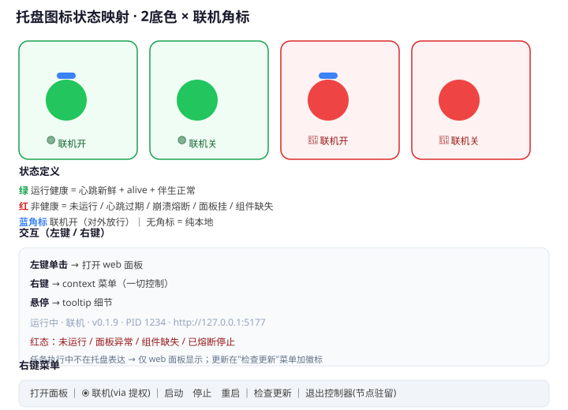

# agent-node 看门狗启动器（Launcher+Watchdog）设计定稿

> 状态：设计定稿（已过 WorkBuddy 架构审查，v1 待实现）
> 主题：一个便携、人类可见、提供托盘与开关控制的启动器/看门狗 exe
> 审查来源：`docs/launcher-watchdog-design.md`（旧版）经本机 WorkBuddy 执行器通读源码审查，结论"方向正确、可落地"，并修正错误 3 处、补遗漏 8 处、建议后置过度设计 4 项。本文件即吸收审查意见后的**定稿**，分 **v1（MVP）/ v2（后置）** 两阶段。

---

## 0. 版本与范围总览

| 阶段 | 范围 | Go 代码量 | 节点改动 |
|---|---|---|---|
| **v1（MVP）** | 单实例 + 持有/监督 + 退避熔断 + 托盘两态 + 左键开面板 + 右键启/停/重启 + 日志落盘 | ~250 行 | **0 改动**（健康判定直接用现有 `/api/overview`） |
| **v2（后置）** | 联机开关（防火墙）+ 联机角标；更新检查；优雅停止 `/api/node/stop`；run_as_admin 托管 | 追加 | 需加 `/api/node/stop` 等 |

> **关键裁决（采纳 WorkBuddy 建议）**：
> 1. **砍掉心跳文件（原 D4）**，v1 健康判定只用 **进程存活（node.lock PID）+ HTTP `/api/overview`**。零节点新增代码、无双源漂移、端到端验证（HTTP 200 = uvicorn+应用+core 全栈活）。
> 2. **联机开关、更新检查、心跳文件、4 组托盘图标全部后置 v2**。v1 只做绿/红两态。
> 3. 启动命令契约 C1 **升级为四元组**（详见 §5），不能是"一条命令"。

---

## 1. 定位与目的

解决三件事：

1. **双击即用、零命令行**：给用户一个便携 exe，双击即可让系统进入可用状态，不再需要敲 `agent-node start` 或双击 `.cmd`。
2. **状态可见性（核心）**：Linux/服务软件最大的痛点是"进程在不在跑"不可见。本组件用**托盘图标**持续、可靠地反映节点健康状态。
3. **开关自由快捷**：右键托盘即可启动 / 停止 / 重启节点 / 打开面板，无需命令行。

**它不做的（边界）**：不碰任何业务逻辑（网络、路由、消息、执行器、MCP、SQLite）。这些全留在 Python 节点里，一行不改。严禁成为"第二套安装逻辑"或"第二处版本源"。

---

## 2. 关键设计决策（v1 生效）

| # | 决策 | 说明 | 阶段 |
|---|---|---|---|
| D1 | **便携启动器 + 固定软件目录** | exe 放哪都行，但始终从 `%LOCALAPPDATA%\agent-node\` 定位软件本体。即"便携的入口 + 固定的家"。 | v1 |
| D2 | **看门狗自动重启（带退避熔断）** | 作为父进程持有节点，崩溃立即收到信号并重启用退避+熔断防护死循环。 | v1 |
| D3(后置) | **更新：每次启动自动检查，只提示** | 启动时查一次 GitHub releases，有新版本则托盘提示，用户确认才下载。**v1 不做**——v1 更新 = 用户手动跑 install.ps1（D6）。 | v2 |
| D4(废弃) | **健康判定不用心跳文件** | ~~周期性写 `data/heartbeat.json`~~ **已砍**。v1 用 `node.lock PID + HTTP /api/overview`，详见 §4。 | — |
| D5(后置) | **"联机"开关收敛权限与风险** | 默认单机自用、零管理员；需对外才显式打开，需管理员放行防火墙。**v1 不做**，且原"风险归零"表述不成立（见 E2）。 | v2 |
| D6 | **首次未安装 → 调用 install.ps1 (irm)** | exe 不内置安装逻辑，只检测 + 调用，安装仍由现有 `scripts/install.ps1` 单一维护。 | v1 |
| D7 | **控制器退出不杀节点** | 符合"节点保持驻留"硬约束。托盘退出 ≠ 节点停止。**仅对直接子进程 WaitForSingleObject，禁止 Job Object `KILL_ON_JOB_CLOSE`**（否则违反 D7，见 M8）。 | v1 |

---

## 3. 生命周期状态机

```
                 ┌─────────────┐
                 │  EXE 启动    │
                 └─────┬───────┘
                       │ 启动器自身单实例互斥量(见M9)
                       ▼
            已有看门狗在跑？──是──→ 退出（不重复启动）
                       │否
                       ▼
               检测 %LOCALAPPDATA%\agent-node
                       │
        ┌──────────────┼──────────────┐
        ▼              ▼              ▼
   已装且完整      已装但不完整(并入🔴)  未安装
        │              │              │
   读 node.lock    🔴 + tooltip"组件缺失" 弹出"需要安装"
        │                              │
   ┌────┴────────────┐            是──┘ └──否
   ▼                ▼              调用irm  退出
 spawn 新节点    节点存活？──是→(监督者模式)
 (持有子进程)      │否               │
        │          ▼                │
        └────→ spawn 新节点 ◄───────┘
                 │
                 ▼
        托盘图标按 进程存活 + /api/overview 渲染
```

- **"已装但不完整 / 组件缺失"** = 无进程 + `app/venv/data` 缺失 → 并入 🔴 + tooltip"组件缺失，请重新安装"（v1 少一个状态机分支，采纳审查 P1）。

---

## 4. 进程模型与健康判定（v1 核心）

### 4.1 持有 vs 监督

Windows 进程模型的硬限制：**父进程关系在 spawn 时一次性确定，无法事后接管**。

| 场景 | 关系 | 能力 |
|---|---|---|
| 看门狗 **spawn** 节点 | 父→子 | 立即收到退出信号；可杀、可重启、真正持有。✅ 可靠 |
| 节点已存在（孤儿/别处启动） | 并行监督者 | 只能读 `node.lock` 的 PID 判存活；感知状态不丢失，但无所有权。下次 spawn 才归己 |

```
spawn_node():
    读 node.lock 的 PID
    存活？ → 进入监督者模式（每 3~5s 轮询 node.lock，不做长期 OpenProcess 句柄）
    死亡？ → spawn 新节点作为子进程
```

### 4.2 健康判定（采用 HTTP，砍心跳文件）

健康 = **进程存活**（C4：node.lock PID 或 owned handle）+ **HTTP `/api/overview`** 可访问。

| 判断 | 依据 |
|---|---|
| 进程活 | node.lock 内 PID 存在（`OpenProcess` 判定） |
| 应用全栈活 | `GET /api/overview` 返回 200；tooltip 所需字段（**version / pid / panel URL / sync / switches / uptime**）overview **全部已有**，一行不用加 |
| "面板挂而核心活" | 进程活 + HTTP 不通 → 判 🔴，tooltip 写"面板异常"（不用心跳细分原因） |

> **为什么 HTTP 优于心跳文件**（采纳审查 §四）：心跳 = overview 的第二份拷贝 → version/pid 必然漂移（双源真相）；HTTP 零节点改动、端到端验证（200 = 全栈活）、天然覆盖 panel.url 死链。心跳文件是纯成本，已废弃。

---

## 5. 启动命令契约 C1（升级为四元组，防双进程的完整要点）

**C1 不是"一条命令"，必须四元组**——原样移植 `scripts/agent-node.ps1` 的 `Resolve-NodeLauncher`（ps1:53-71）逻辑：

```
C1 = {
  exe:  ① 解析 <ROOT>\venv\pyvenv.cfg 的 "home" → <home>\pythonw.exe
        ② 回退：PATH 找 "python" → 同目录 pythonw.exe
        ③ 兜底：<ROOT>\venv\Scripts\pythonw.exe     （与 ps1 三级回退完全一致）
  args: -m node.main --data-dir <DATA>
  cwd:  <ROOT>\app          # 关键：-m 模式 sys.path[0]=cwd，import node/server 靠它
  env:  PYTHONPATH = <ROOT>\venv\Lib\site-packages   （前置，保留已有值；ps1 Get-VenvSitePackages 同款）
}
```

要点：

1. **pyvenv.cfg 解析**：UTF-8（注意 BOM）、逐行 `key = value`、忽略 `#`、key 大小写不敏感——语义对齐 ps1。解析结果必须写日志（M7）。
2. **为什么 cwd 必须 = app**：`python -m node.main` 把当前目录放 sys.path[0]；缺了它 `import node/server` 失败（另一处"启动必挂点"）。
3. **为什么 PYTHONPATH 只加 venv site-packages**：base 解释器直启时 sys.prefix=base，venv 依赖（fastapi/uvicorn/websockets…）只能经 PYTHONPATH 可达；缺了 = 启动即 ModuleNotFoundError。
4. **选做加固**：读 pyvenv.cfg `version` 与 `<home>\pythonw.exe` 实际版本比对，不一致给警告（防 home 指向被卸载版本）。
5. **不需要移植 `Remove-DuplicateNode`**：双进程根源是 venv 转发器；用 base 直启根本不会产生转发器，且节点 2.11.3 内核互斥量已原子防重，此兜底可砍。
6. **就绪判定**（复用 ps1 已验证模式）：spawn 后轮询 ≤40s：node.lock 存在 + panel.url 存在 + GET /api/health 200 → 绿；超时 → 红 + tooltip 指 node.log。
7. **Go 提示**：CreateProcess 用 `CREATE_NO_WINDOW`(0x08000000)，stderr 句柄指向文件；`golang.org/x/sys/windows` 有 CreateMutexW/OpenProcess，**无 cgo**，GOOS=windows GOARCH=amd64 交叉编译。

### 5.1 C1 数据化：data/launch.json（v2 外置启动清单）

**动机**：C1 四元组的解析逻辑内嵌在 exe（paths.go `resolveLauncher`/`buildLaunchInbuilt`），一旦节点侧（venv 布局/pyvenv home/依赖路径）演进就需要重编启动器。v2 把 C1 的"最终产物"外置为 JSON，实现启动器与节点部署解耦（节点更新不换 exe）。

- **流向**：`scripts/install.ps1` 的 `Write-LaunchJson` 生成 `data/launch.json`（哈希表 + `ConvertTo-Json` 构造，原子写 `.tmp`→`Move`，保留上一份为 `.bak`）；**exe 只消费、不生成、不下载**（单一维护点 D6）。
- **schema**（`schema_version` 整数区间，当前 [1,1]）字段只增不改、语义稳定：

```json
{
  "schema_version": 1,
  "min_launcher": "0.0.0",
  "install_check": ["{ROOT}/app", "{VENV}", "{DATA}"],
  "spawn": {
    "exe": "{VENV}/Scripts/pythonw.exe",
    "args": ["-m", "node.main", "--data-dir", "{DATA}"],
    "cwd": "{ROOT}/app",
    "env": {"PYTHONPATH": "{VENV}/Lib/site-packages"}
  },
  "health": {"endpoint": "/api/overview"},
  "ready_timeout_ms": 40000
}
```

- **路径模板**：`{ROOT}`/`{DATA}`/`{VENV}` 在 exe 侧展开（每用户 `%LOCALAPPDATA%` 不同，多账户可移植）。示例中非 spawn.exe 的路径均写模板；**`spawn.exe` 例外**——Install 优先写解析后的绝对路径（base home pythonw 可能在 ROOT 外，无法模板化），install_check 的第一条 exe 项同步追踪该实际 spawn.exe（**P2-2：不恒固定 `venv\Scripts\pythonw.exe`**，否则 home pythonw 场景下 venv 转发器缺失会误判组件缺失拒绝拉起）。
- **回退链（关键，严禁破坏）**：`launch.json` → `launch.json.bak` → 内置 `buildLaunchInbuilt`（paths.go）。JSON 缺失/损坏/schema 超界/min_launcher 高于本 exe → 一律回退内置；**绝不自动删除 launch.json**（损坏防护）。
- **min_launcher 阻断语义（P2-1）**：min_launcher 高于本 exe 时，`spawn`、`health.endpoint`、`ready_timeout_ms`、`install_check` **四者整体视为文件不可用**，统一走内置/缺省（不出现"spawn 用内置、健康/就绪/完整性仍读过新文件"的分裂）。实现：`loadUsableLaunch` 在 min_launcher 阻断时返回 err，各消费方（resolveLaunchSpec / healthEndpoint / launchReadyTimeoutMS / installedRoot）据此回退。
- **语义约束**：
  - `spawn.exe/cwd` 必填（trim 后非空）；exe 解析后需真实存在。
  - `health.endpoint` 仅允许路径后缀（`/` 开头）；空则默认 `/api/overview`；裸 host / 完整 URL / 含空白一律拒绝——**base 单一来源仍是 `panel.url`**，杜绝"第二端口源"。
  - `spawn.env` 与既有环境合并：展开并去空白后为空值则跳过（不清空既有 PYTHONPATH）；非空值前置、已有则拼接保留。
  - `install_check` 非空时，安装完整性检查随其外置（模板化路径）；空/缺失回退内置布局检查（app/venv/data + venv\Scripts\pythonw.exe）。
- **版本接线**：`min_launcher` 用于能力级变更时通知"exe 过旧需换"；`launcherVersion` 由构建注入（build.ps1 / GitHub Actions 均注入），二者比较不回退则用 JSON，否则回退内置。
- **每次 spawn 现读**（不缓存到 launcher 生命周期），保证节点更新后 `launch.json` 立即生效。
- **就绪超时**：`ready_timeout_ms` 可选，缺省 40000（与 spawn 后 booting 就绪判定联动）。

---

## 6. 重启风暴防护（看门狗核心，含 M2 语义修正）

自动重启必须防死循环：

- **退避策略**：连续崩溃次数 N，重启间隔指数增长。
- **熔断阈值**：如 1 分钟内崩溃 ≥ 3 次 → 停止重启，托盘转 🔴，提示用户看 `data/node.log`。

**⚠️ 退出码语义（采纳 M2，看门狗的灵魂）**：
- **exit code 0** = 正常退出（`node.main` 主循环正常结束）→ **不触发重启**。
- **exit code 1** = `core.start()` 抛 RuntimeError，**包括"单实例被拒"**（`_acquire_kernel_mutex`/`_acquire_single_instance` 均抛 RuntimeError）。
- **判别规则（避免误熔断）**：

```
子进程退出码 == 1 → 查 node.lock
   lock 存在 && 其中 PID 存活  → 节点已被他人持有 → 转监督者模式，不计崩溃
   lock 已清理（无活 PID）     → 真启动失败 → 按崩溃计数 + 退避
子进程退出码 0                → 手动停止/优雅退出，不重启
其他非 0                      → 崩溃 → 退避重启
```

> 不采此规则会在"spawn 瞬间节点已存在"时把正常"被拒"误判为崩溃、误计熔断、托盘假红。

**M3 看门狗 vs `restart_self` 互踩**（v2 决）：
- 面板/AI 触发的 `core.restart_self()` 会杀本进程由分离 PowerShell 再拉起。看门狗见子进程死 → 自动重启 → 与 restart_self 新进程争锁。
- **v1 缓解（M3a）**：子进程死后 **宽限期 5~8s** 内重查 node.lock，发现新活 PID → 转监督者（自己不 spawn）；仍无 → 按崩溃重启。
- **v2 治本（M3b+M5a）**：给节点加 `POST /api/node/stop`（优雅停止：stop_event → core.stop() → 退出码 0），托盘"重启" = stop → 确认退出 → spawn，彻底绕开 restart_self。

---

## 7. 托盘设计（v1 两态）

### 7.1 状态映射（两态，不做中间态）

托盘图标只承载**一眼健康度**。**v1 只有 2 个图标资源**（绿/红），联机角标随 D5 后置。

| 图标 | 含义 | 触发 |
|---|---|---|
| 🟢 绿 | 运行健康 | 进程存活 + `/api/overview` 200 |
| 🔴 红 | 非健康态（不细分） | 未运行 / 面板异常(进程活但HTTP不通) / 崩溃熔断 / 组件缺失 |

> **不做橙色中间态**（纠正原 E3 自相矛盾）：红色原因全部靠 tooltip（§7.3）表达，不靠颜色细分；"任务执行中"不用图标，仅在 web 面板显示。

### 7.2 交互（左键 / 右键）

| 操作 | 行为 |
|---|---|
| **左键单击** | 打开 web 面板 |
| 右键 | 打开 context 菜单（一切控制） |
| 悬停 | tooltip 显示细节文本 |

**左键只设"单击打开面板"**，不做双击——托盘"单击+双击"组合会互相干扰。打开面板用**启动器自己健康探测得到的活 URL**（复用 §4.2 的 overview 探测），不盲读可能失效的 panel.url（M6）。

context 菜单（v1）：

```
打开面板 ──────→ 用探测到的活 URL 打开浏览器
────────────────────
启动节点 ──────→ spawn（受 §4、§6 约束）
停止节点 ──────→ taskkill /PID <pid> /T /F（与 ps1 一致；v2 改优雅 stop）
重启节点 ──────→ 停止 → 确认退出 → 启动
────────────────────
退出控制器 ────→ 仅退出托盘（节点驻留，明确标注"节点仍在运行"）
```

> v2 追加：联机开关、检查更新。

### 7.3 tooltip 细节文本

**tooltip（悬停）**：一行可读文本，如
`运行中 · v0.1.9 · PID 1234 · 面板 http://127.0.0.1:5177`
红态时给原因：`未运行` / `面板异常` / `组件缺失` / `已熔断停止`。

### 7.4 附图

状态映射、交互（左键/右键/悬停）与右键菜单的可视化总览（v1 部分为两态，联机角标为 v2）：



---

## 8. 安装

### 8.1 首次安装（D6）

- exe 检测到未装 → 弹窗"需要安装，是否继续？"
  - 是 → 隐藏窗口调用 PowerShell `irm <install.ps1 url> | iex`（`-WindowStyle Hidden`，避免黑窗口突兀）
  - 否 → 退出
- 安装逻辑**不内置 exe**，仍在 `scripts/install.ps1`（单一维护点）。
- **v1 更新 = 用户手动跑 install.ps1**（D3 后置）。

---

## 9. 日志与可观测性（M7，v1 必做）

| 写入 | 内容 |
|---|---|
| `data/launcher.log` | 启动器自身：重启循环、pyvenv.cfg 解析结果、exit code、熔断状态（RotatingHandler 10MB×5） |
| `data/launcher-stderr.log` | **spawn 时把子进程 stderr 句柄重定向到该文件**（CreateProcess 直接给文件句柄）|

> pythonw 无控制台，启动失败（import 错误等）traceback 不重定向就无处可查 "双击没反应"。

---

## 10. 权限策略（v1 简化）

### 10.1 v1 权限

| 动作 | 是否需要管理员 |
|---|---|
| 下载/建 venv/pip 装依赖 | 否 |
| 写 `data/` 配置 | 否 |
| 跑节点/托盘/HTTP | 否 |
| 启动器自身 | **否**（v1 默认全程零管理员） |
| 防火墙入站 | **v1 不做**（联机后置） |

### 10.2 联机开关（D5，v2）

> v2 补充。**纠正原 E1/E2 两处错误**：

- **E1 防火墙规则挂程序路径失效**：不能用 `program=venv pythonw`（那是转发器，瞬间退出；真正监听的是 base pythonw，路径随 Python 版本漂移）。**改用固定端口段**（全部是 `node/config.py` 里的常量，有唯一来源）：
  - UDP 入站：`41830, 41550, 60420, 31820, 26880`（discovery_ports）
  - TCP 入站：`49700`（announce_tcp_port）+ `49710–49729`（DEFAULT_PEER_PORT_START/END）
  - 兜底：peer 段满才随机端口，此时该节点入站不保证放行——接受并在文档标注。
- **E2 "联机关=风险归零"不成立**：`mesh`/`beacon` 一直 bind `0.0.0.0`，socket 层面节点始终监听所有接口；"归零"实际依赖系统防火墙默认拦入站。文档措辞改为 **"联机关 = 不主动放行入站（依赖系统防火墙默认策略）"**。真正硬归零需改节点绑定回环/关发现——v1/v2 都不做。
- **提权方式**：启动器默认普通权限；开联机且非管理员 → 提示"右键以管理员身份运行"，**不做静默 UAC 提权**。

---

## 11. 已知注意点 / 风险（已并入审查结论）

| 项 | 处置 |
|---|---|
| A1 控制台句柄 | spawn 用 `pythonw.exe`（无窗口）；CreateProcess `CREATE_NO_WINDOW`。已确认 |
| M8 Job Object 连坐 | **禁止** `KILL_ON_JOB_CLOSE`（托盘退出会连坐杀节点，违反 D7）。只对直接子进程句柄 WaitForSingleObject；停止显式 `taskkill /T /F` |
| M9 单实例互斥量命名 | 节点互斥量=`"AgentNode_"+sha1(data_dir)[:24]`（core.py:295）。**启动器必须用自己的名字**如 `"AgentNodeLauncher_"+sha1(data_dir)[:24]`，`bInitialOwner=True` + 检 `ERROR_ALREADY_EXISTS`，持句柄到退出。防二次启动 exe 撞节点锁误判"已在运行" |
| M2 退出码 1 = 被拒 | 见 §6，看门狗灵魂，不可省 |
| M3/M5 restart_self / 优雅停止 | v1 用宽限期缓解；v2 加 `/api/node/stop` |
| M4 run_as_admin | v2：读 `data/node_config.json` 的 `run_as_admin`，为 true 时仅允许管理员身份启动器托管 spawn，否则只监督并 tooltip 提示 |
| F1 多账户 | `%LOCALAPPDATA%` per-user，换账户重新引导安装（既有约束） |
| PID 复用 | 用 node.lock PID 判定 + 启动器记录 spawn 进程句柄双保险 |

---

## 12. 控制器 ↔ 节点契约（v1 生效）

控制器仅依赖节点暴露的少量薄契约。这是"节点重构，控制器不用重写"的前提，契约须稳定化。

### 12.1 三条稳定契约（v1）

| # | 契约 | 控制器用途 | 变更影响 |
|---|---|---|---|
| C1 | 启动**四元组**：解析 base pythonw + args + cwd=app + PYTHONPATH=venv-site-packages | spawn 节点（§5） | 变 → 需同步 |
| C3 | `data/panel.url` + **HTTP `/api/overview`** | 打开面板 + 健康判定（§4.2） | overview 字段只增不改 → 免改 |
| C4 | `data/node.lock` | 判存活 / 监督者分支（§4.1） | 同上 |

> **C2 心跳文件已废弃**（§4.2），不再作为契约面。

### 12.2 兼容约定

- **overview 字段"只增不改、语义稳定"**：新版本可新增字段，不得重命名/改既有字段语义；控制器解析用"忽略未知键"策略。
- **C1/C3/C4 视为公共 API**：路径与格式变更必须进 CHANGELOG，并同步控制器常量/解析逻辑。
- 拒绝"控制器反向依赖节点内部符号"——只通过上述文件/HTTP 交互，不 import 节点代码。

### 12.3 升级 vs 重写边界

| 场景 | 对控制器影响 |
|---|---|
| 节点重构（换语言、改路由、改 executor 内部实现） | 契约不变 → **免改、免重装** |
| 契约小改（overview 新增字段、端口记录微调） | 常量/解析同步 → **小改**，非重写 |
| 监管层角色变更（不做看门狗） | 需求变更 → **才需重写** |

---

## 13. 建议实现语言

| 语言 | 体积 | 托盘库 | 评价 |
|---|---|---|---|
| **Go（推荐）** | 单 exe ~2MB | `getlantern/systray` / `fyne/systray` | 交叉编译简单、零依赖、后台线程好写 |
| Rust | 单 exe ~1MB | `tray-icon` | 高速但学习成本高 |
| C# | 需 .NET runtime | NotifyIcon 原生 | 系统自带 Win10+，备选 |

**代码量**：v1 ~250 行（无安装/更新/联机逻辑）；v2 追加联机 + 更新 + 优雅停止协调。

---

## 14. 落地步骤

### v1（MVP）
1. Go 启动器骨架：启动器自身单实例互斥量（M9）+ 检 `%LOCALAPPDATA%\agent-node`（D1/D6）。
2. 持有/监督六（C2）+ 进程存活判定（C4）。
3. C1 四元组 spawn（§5）+ stderr 重定向 + launcher.log（M7）。
4. 退避熔断 + **M2 退出码语义**（§6）+ M3a 宽限期。
5. 托盘两态 + 左键面板（用 overview 活 URL）+ 右键启/停/重启（taskkill /T /F）+ 退出不杀节点（D7/M8）。
6. 健康判定 = node.lock PID + `/api/overview`（§4.2）。
7. 装缺失 → 提示跑 install.ps1（D6）。
8. 集成测试：崩溃重启、熔断、多实例竞态、双层互斥量命名不互撞。

### v2（后置）
- 联机开关（固定端口段防火墙规则）+ 联机角标（D5）。
- 更新检查（GitHub releases 轮询 + 提示 + 更新前停机协调）（D3）。
- 优雅停止 `POST /api/node/stop`（M3b/M5a）。
- run_as_admin 托管逻辑（M4）。